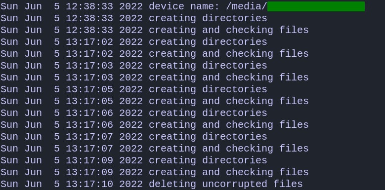

Flash Project
========================
### Build
```bash
mkdir build
cd build
cmake ../CMakeLists.txt
make
```
### Usage
you should use param `-d` or `--device` to pass path to your device
#### Example
On Windows:
```bash
FlashProject.exe -d <path to device> # e.g. F:/
```
On Unix-like systems:
```bash
./FlashProject -d <path to device> # e.g. /media/<user name>/<device>
```

### To view docs:
Insert into url in browser absolute path to the file:

#### On Windows:
```url
C:/alex/FlashProject/docs/html/annotated.html
```

#### On Unix-like systems:
```url
file:///home/alex/programming/Cpp/FlashProject/docs/html/annotated.html
```
It will look like this:


### Contributors
- [Gorlov](https://github.com/gxrlxv) - logging, folder tree creation, uuidv4 generation function.
- [Gusarov](https://github.com/gusarow4321) - work on the main cycle of the program, the file splitting algorithm, file creation and processing, output of the result of the program.
- [Stikentzin](https://github.com/Skijetler) - checking files, working on the main program cycle, documentation, deleting uncorrupted files.
- [Zhukov](https://github.com/Abuzik) - seed and binary sequence generation.
- [Lyakishev](https://github.com/Vasillisska) - creating and processing files.
- [Alekhine](https://github.com/alehindev) - licensing and manual testing. 


### Working process
After executing FlashProject.exe on Windows or ./FlashProject on Unix/MacOS program will output similiar to that:



### Tests:
Tested on flash under Ubuntu:
- Total space - 13Gb
- File system type: etx3/ext4

- Program output:

- Folders left:

- Final size of the folder - 

